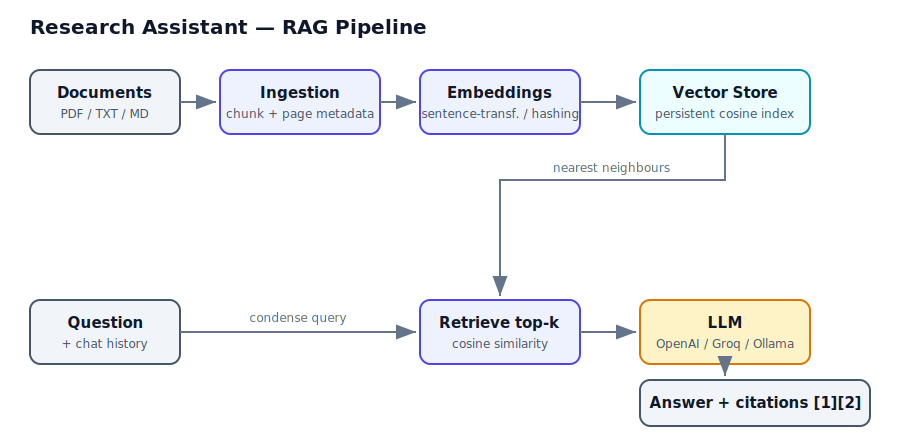

# 📚 AI Research Assistant (RAG)

[](https://github.com/sarthak140704/RAG-based-document-assistant/actions/workflows/tests.yml)

[](https://rag-based-document-assistant-sarverma1407.streamlit.app/)

Ask questions across your own documents (PDF / TXT / Markdown) and get concise
answers **with inline citations** back to the exact source and page. Built as a
clean, from-scratch **Retrieval-Augmented Generation (RAG)** pipeline.

> Final-year / portfolio project. Designed to be *impressive but practical*:
> it runs fully offline with zero API keys, yet upgrades to real LLMs and
> semantic embeddings with a single environment variable.

🔗 **Live demo:** https://rag-based-document-assistant-sarverma1407.streamlit.app/ &nbsp;·&nbsp; 💻 **Source:** https://github.com/sarthak140704/RAG-based-document-assistant

---

## ✨ Features

- **End-to-end RAG**: ingestion → chunking → embedding → retrieval → grounded generation.
- **Citations everywhere** — every answer references the passages it used (`[1]`, `[2]`), with source file + page.
- **Hybrid search + re-ranking** — fuses BM25 keyword search with dense vectors via Reciprocal Rank Fusion, plus an optional cross-encoder re-ranker.
- **Streaming answers** — responses render token-by-token, like ChatGPT.
- **Conversation memory** — ask follow-ups ("and why is that?"); the query is condensed with chat history before retrieval.
- **Confidence signal** — surfaces the top retrieval score and warns on low-confidence answers; optional `MIN_SCORE` gate drops weak matches.
- **Structure-aware chunking** — packs whole sentences/paragraphs (with overlap) instead of blind word windows.
- **Runs offline, no keys needed** — a built-in *extractive* answerer and a pure-NumPy *hashing* embedder mean `pip install` → run.
- **Pluggable LLMs** — OpenAI, Azure OpenAI, **Groq (free)**, or local Ollama via one env var.
- **Pluggable embeddings** — `sentence-transformers` for quality, or hashing for speed/offline.
- **Persistent vector store** — lightweight NumPy cosine store (drop-in concept for FAISS / Chroma / Pinecone).
- **Evaluation harness** — measures retrieval hit-rate, citation rate, and answer grounding.
- **Two front-ends** — a Streamlit chat UI and a CLI.
- **Docker-ready** — a lean image runs anywhere with `docker build` + `docker run`.
- **Tested + CI** — unit tests for chunking, retrieval, persistence, and evaluation, run on every push via GitHub Actions (with ruff linting).

## 🎬 Demo

<!-- Record a short screen capture of the live app and save it as docs/demo.gif -->
<!-- (e.g. with ScreenToGif on Windows), then it will show here automatically.  -->


## 🏗️ Architecture



| Module | Responsibility |
| --- | --- |
| `src/ingestion.py` | Load PDFs/text, structure-aware chunking with page metadata |
| `src/embeddings.py` | `sentence-transformers` or pure-NumPy hashing embedder |
| `src/vectorstore.py` | Persistent, normalized cosine-similarity store |
| `src/keyword.py` | Dependency-free BM25 keyword index |
| `src/retrieval.py` | Hybrid retriever (RRF fusion) + optional cross-encoder re-rank |
| `src/llm.py` | Provider-agnostic LLM (streaming + memory) + extractive offline fallback |
| `src/rag.py` | Orchestrates ingest / retrieve / answer |
| `src/evaluation.py` | Retrieval + grounding metrics |
| `app.py` / `cli.py` | Streamlit UI / command line |

## 🚀 Quickstart

**Windows (PowerShell):**

```powershell
# 1. (optional) create a virtual environment
python -m venv .venv
.\.venv\Scripts\Activate.ps1

# 2. install
pip install -r requirements.txt

# 3. copy the example env (defaults work offline, no keys required)
copy .env.example .env

# 4a. run the web app
streamlit run app.py

# 4b. …or use the CLI
python cli.py ingest data/sample.txt
python cli.py ask "What is retrieval-augmented generation?"
```

**macOS / Linux (bash):**

```bash
# 1. (optional) create a virtual environment
python3 -m venv .venv
source .venv/bin/activate

# 2. install
pip install -r requirements.txt

# 3. copy the example env (defaults work offline, no keys required)
cp .env.example .env

# 4a. run the web app
streamlit run app.py

# 4b. …or use the CLI
python cli.py ingest data/sample.txt
python cli.py ask "What is retrieval-augmented generation?"
```

### ⚡ Fastest offline start (no torch download)

Set the hashing embedder to skip the large `sentence-transformers`/torch download:

```powershell
$env:EMBEDDING_BACKEND = "hashing"
python cli.py ingest data/sample.txt
python cli.py ask "Why does chunk overlap matter?"
```

## 🔌 Using a real LLM

By default the app uses the offline **extractive** answerer (no key needed),
which returns cited passages. To get fluent, natural-language answers, plug in
an LLM by editing `.env` (local) or **Streamlit → Settings → Secrets** (cloud):

```ini
# OpenAI
LLM_PROVIDER=openai
LLM_MODEL=gpt-4o-mini
OPENAI_API_KEY=sk-...

# or local Ollama
LLM_PROVIDER=ollama
LLM_MODEL=llama3
```

For best retrieval quality, keep `EMBEDDING_BACKEND=st` (the default).

### 🆓 Use a FREE LLM key (Groq — recommended)

[Groq](https://groq.com) offers a **free API key (no credit card)** and is
OpenAI-compatible, so it works with this app out of the box — you only add a
`base_url`. Steps:

1. Go to **[console.groq.com](https://console.groq.com)** and sign up (free).
2. Open **API Keys → Create API Key**, and copy it (starts with `gsk_...`).
3. Add these to your config:
   - **Locally** — put them in `.env`:
     ```ini
     LLM_PROVIDER=openai
     LLM_MODEL=llama-3.1-8b-instant
     OPENAI_API_KEY=gsk_your_key_here
     OPENAI_BASE_URL=https://api.groq.com/openai/v1
     ```
   - **On Streamlit Cloud** — go to **Manage app → Settings → Secrets** and paste
     the same values in TOML form (each on its own line, values in quotes):
     ```toml
     LLM_PROVIDER = "openai"
     LLM_MODEL = "llama-3.1-8b-instant"
     OPENAI_API_KEY = "gsk_your_key_here"
     OPENAI_BASE_URL = "https://api.groq.com/openai/v1"
     ```
4. **Save** the secrets (the app auto-reboots), then ask a question — the sidebar
   will show `LLM provider: openai` and answers will now be fluent + cited.

> Other free options: **[OpenRouter](https://openrouter.ai)** has free models
> (use `OPENAI_BASE_URL=https://openrouter.ai/api/v1`), and **Google Gemini**
> has a free tier via [AI Studio](https://aistudio.google.com). Groq is the
> simplest because it needs no code changes and is extremely fast.


## 📊 Evaluation

```powershell
python cli.py ingest data/sample.txt
python cli.py eval data/eval_qa.json -v
```

Reports, for the QA set in `data/eval_qa.json`:

- **retrieval_hit_rate** — did the right document get retrieved?
- **citation_rate** — did the answer include citations?
- **grounded_rate** — did the answer contain the expected fact?

## 🧪 Tests

```powershell
pip install pytest
python -m pytest -q
```

Lint (same checks as CI):

```powershell
pip install ruff
ruff check .
```

## 🐳 Docker

Run the whole app in a container — no local Python needed:

```bash
docker build -t research-assistant .
docker run -p 8501:8501 research-assistant
# open http://localhost:8501
```

The image is lean (uses the `hashing` embedder, no torch). To use a real LLM,
pass env vars at run time:

```bash
docker run -p 8501:8501 \
  -e LLM_PROVIDER=openai \
  -e LLM_MODEL=llama-3.1-8b-instant \
  -e OPENAI_API_KEY=gsk_your_key \
  -e OPENAI_BASE_URL=https://api.groq.com/openai/v1 \
  research-assistant
```

## ⚙️ Configuration (env vars)

| Variable | Default | Notes |
| --- | --- | --- |
| `LLM_PROVIDER` | `extractive` | `extractive` \| `openai` \| `azure` \| `ollama` |
| `LLM_MODEL` | `gpt-4o-mini` | Model name for the chosen provider |
| `EMBEDDING_BACKEND` | `st` | `st` (sentence-transformers) \| `hashing` |
| `EMBEDDING_MODEL` | `all-MiniLM-L6-v2` | sentence-transformers model |
| `CHUNK_SIZE` | `200` | Chunk size in words |
| `CHUNK_OVERLAP` | `40` | Overlap in words |
| `TOP_K` | `4` | Passages retrieved per query |
| `MIN_SCORE` | `0.0` | Drop chunks below this similarity (0 = off) |
| `RETRIEVAL_MODE` | `hybrid` | `hybrid` (BM25 + vector) or `vector` |
| `CANDIDATE_K` | `10` | Candidates per retriever before fusion |
| `RERANK` | `none` | `none` or `cross-encoder` (needs sentence-transformers) |

## ☁️ Deploy to Streamlit Community Cloud (free)

Get a public live-demo link in a few clicks:

1. Push this repo to GitHub (already done).
2. Go to **[share.streamlit.io](https://share.streamlit.io)** and sign in with GitHub.
3. Click **Create app → Deploy a public app from GitHub** and select:
   - **Repository:** `sarthak140704/RAG-based-document-assistant`
   - **Branch:** `main`
   - **Main file path:** `app.py`
4. Open **Advanced settings → Secrets** and paste (keeps the free tier fast & within memory):
   ```toml
   EMBEDDING_BACKEND = "hashing"
   # Optional real LLM:
   # LLM_PROVIDER = "openai"
   # LLM_MODEL = "gpt-4o-mini"
   # OPENAI_API_KEY = "sk-..."
   ```
5. Click **Deploy**. You'll get a URL like `https://<app-name>.streamlit.app` that
   **auto-redeploys on every `git push`**.

> 💡 The free tier has ~1 GB RAM. `EMBEDDING_BACKEND=hashing` avoids the large
> torch download and runs comfortably. Switch to `st` for best semantic quality
> when running locally or on a larger instance.

Finally, replace the **Live demo** link at the top of this README with your new URL.

## 🗺️ Roadmap / stretch goals

- Hybrid search (keyword + vector) and re-ranking
- Streaming answers and conversation memory
- Swap the NumPy store for FAISS/Chroma at larger scale
- LLM-as-a-judge faithfulness scoring in the eval harness

## 🎤 Resume talking points

- Built a production-shaped **RAG** system with **source-grounded citations**.
- Designed **provider- and embedding-agnostic** abstractions (offline fallback → real LLMs).
- Added a **quantitative evaluation harness** separating retrieval vs. generation quality.
